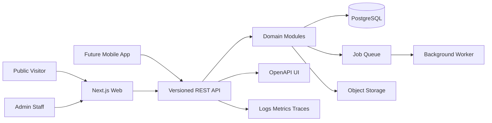

# System Architecture

## Recommended Shape

Start with a **modular monolith** in a TypeScript monorepo. It keeps transactions and delivery simple while enforcing module boundaries that can later become services if scale demands it.



## Proposed Repository Layout

```text
apps/
  web/                 Next.js public site, admin portal, and API route adapter
  worker/              queued exports, notifications, images, and scheduled jobs
packages/
  db/                  Drizzle schema, migrations, seeds, and database client
  domain/              framework-independent competition and profile rules
  api-contract/        schemas, OpenAPI registry, DTOs, and API client generation
  auth/                token, session, permission, and identity helpers
  ui/                  shared web components and design tokens
  config/              lint, TypeScript, test, and environment configuration
docs/
  plans/
  decisions/
```

## Technology Baseline

| Concern | Recommendation |
| --- | --- |
| Web | Next.js App Router, React, TypeScript |
| Styling | Tailwind CSS plus CSS custom-property design tokens |
| Database | PostgreSQL with Drizzle ORM and checked-in SQL migrations |
| Validation | One runtime schema system shared by handlers and OpenAPI generation |
| API | REST JSON under `/api/v1`; contract-first OpenAPI |
| Authentication | Phone OTP for gamers; stronger staff authentication with MFA/passkeys where available |
| Jobs | PostgreSQL-backed queue initially; move only if operational needs justify it |
| Storage | S3-compatible object storage with signed uploads and image variants |
| Testing | Unit, integration against PostgreSQL, API contract, and browser end-to-end tests |
| Observability | Structured logs, request IDs, error tracking, metrics, and traces |

Exact package versions should be selected during scaffolding and locked by the package manager rather than frozen in planning documents.

## Domain Modules

- **Identity and Access:** users, identities, sessions, OTP, staff roles, permissions, and audit context.
- **Geography:** countries, regions, cities, time zones, and localized labels.
- **Gamers:** gamer profile, game handles, roles, statistics, privacy, verification, and exports.
- **Teams:** organizations, rosters, invitations, leaders, lineup history, and eligibility.
- **Sponsors:** sponsor organizations, contacts, verification, sponsorship lifecycle, and public placement.
- **Catalog:** games, platforms, modes, roles, statistic definitions, and scoring presets.
- **Competitions:** tournaments, divisions, registrations, stages, seeding, matches, results, standings, advancement, and disputes.
- **Content:** banners, featured entities, announcements, media, SEO, and publishing schedule.
- **Notifications:** templates, preferences, jobs, provider adapters, and delivery status.
- **Reporting:** admin dashboards, exports, profile PDFs, and analytics projections.

No module reads or writes another module's tables casually. Cross-module operations go through application services, and competition writes run in explicit database transactions.

## Request Flow

1. Route adapter parses headers, authentication, and version.
2. Input schema validates path, query, and body values.
3. Authorization policy evaluates actor, action, resource, and organization scope.
4. Application service executes domain rules inside a transaction when needed.
5. Repository uses Drizzle for explicit queries and mapping.
6. Response mapper returns the stable API DTO, never a raw database row.
7. Audit, metrics, and structured logs record the outcome without secrets or unnecessary personal data.

## Background Work

Use durable jobs for PDF generation, image processing, bracket publication snapshots, bulk notifications, leaderboard recalculation, webhook delivery, and data exports. Use an outbox table written in the same transaction as domain changes so events cannot be lost between the database and worker.

## Caching and Real-Time Updates

- Cache public catalog/profile/tournament reads at the application or CDN layer with explicit tags.
- Invalidate tags after committed publication events.
- Use Server-Sent Events or a hosted real-time transport for live brackets; polling is an acceptable MVP fallback.
- Never cache private responses in a shared cache.

## Deployment Environments

- `local`: isolated developer database and object-storage emulator.
- `preview`: per-change app with non-production data.
- `staging`: production-like migrations, integration checks, and operator acceptance.
- `production`: protected secrets, backups, monitoring, limited staff access, and audited break-glass procedures.

Each environment has independent credentials, storage buckets, token keys, OTP providers, and webhook secrets.

## Architecture Decisions to Record Before Build

1. Hosting platform and its support for long-running workers.
2. OTP/SMS provider and supported launch countries.
3. Object-storage provider and image transformation strategy.
4. API schema/generator library.
5. Queue implementation.
6. PDF renderer and font licensing.
7. Live update transport.
8. Launch game and exact scoring/statistics requirements.

