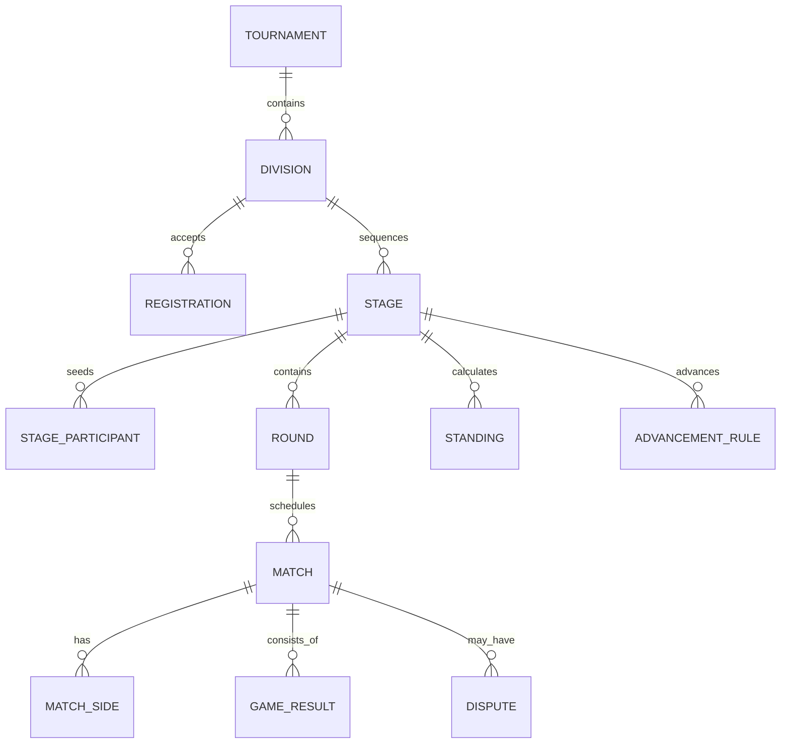

# Data Model

## Modeling Rules

- Use UUID/UUIDv7-style identifiers and never expose sequential business identifiers as authorization boundaries.
- Store timestamps as `timestamptz` in UTC; store the source time zone separately for scheduled events.
- Use `citext` or normalized companion columns for case-insensitive handles where appropriate.
- Prefer status enums/check constraints for stable state machines and reference tables for admin-managed catalogs.
- Use `jsonb` only for genuinely game-specific or versioned configuration; important searchable relationships remain relational.
- Add `created_at`, `updated_at`, and relevant actor identifiers to mutable business records.
- Archive business entities with lifecycle status; do not silently hard-delete competition history.

## Identity and Access

| Entity | Key fields and purpose |
| --- | --- |
| `users` | account status, preferred locale, accepted policy versions |
| `user_identities` | verified phone/email/provider identity; normalized unique value |
| `auth_challenges` | hashed OTP, purpose, attempts, expiry, consumed time |
| `sessions` | refresh-token family, hashed token, device metadata, expiry, revocation |
| `admin_credentials` | salted password hash and the superadmin who provisioned the account |
| `gamer_credentials` | salted scrypt password hash for member password login (kept separate from `admin_credentials`, which doubles as the admin-account marker) |
| `roles`, `permissions`, `role_permissions` | platform permission catalog |
| `user_roles` | user role with optional organization/competition scope and expiry |

## People, Geography, and Privacy

| Entity | Key fields and purpose |
| --- | --- |
| `gamer_profiles` | user, public slug, display name, legal-name privacy, bio, birth-date/band, country, region, city, visibility, verification |
| `countries`, `regions`, `cities` | ISO-aware launch geography and time-zone metadata |
| `profile_contacts` | typed contact value, verification, audience, and consent |
| `profile_privacy_settings` | field-level audience and discoverability controls |
| `profile_verifications` | type, reviewer, evidence, status, expiry, reason |
| `gamer_game_profiles` | gamer, game, handle, platform, region, roles, rank, verification |
| `gamer_achievements` | verified or claimed achievement with source/result link |

## Teams and Sponsors

| Entity | Key fields and purpose |
| --- | --- |
| `teams` | public slug, name, tag, country/city, logo, status, verification |
| `team_memberships` | gamer, team, role, leader flag, start/end, status |
| `team_invitations` | inviter, invited gamer/identity, role, expiry, response |
| `team_lineups` | competition-specific named roster snapshot |
| `team_lineup_members` | gamer, competitive role, substitute/captain flags |
| `sponsor_organizations` | legal/display names, category, website, logo, verification |
| `sponsorships` | sponsor, subject gamer/team/event, dates, lifecycle, public visibility, initiator |
| `sponsorship_assets` | approved logo/creative placement and link metadata |

A team leader is represented by a time-bounded membership role, not a permanent column on `teams`. A sponsorship is mutual and stateful (`proposed`, `accepted`, `active`, `ended`, `declined`, `revoked`).

## Game Catalog

| Entity | Key fields and purpose |
| --- | --- |
| `games` | name, slug, publisher, icon/cover, status |
| `game_modes` | team/individual mode, roster limits, scoring preset |
| `game_roles` | game-specific role catalog |
| `stat_definitions` | key, label, value type, aggregation, unit, validation |
| `scoring_presets` | versioned formula/configuration and tie-break chain |

## Competition Core

| Entity | Key fields and purpose |
| --- | --- |
| `tournaments` | organizer, title, slug, tournament-or-league type, dates, venue/online mode, registration and publication status |
| `divisions` | game/mode, participant type, region, eligibility, roster and check-in rules |
| `registrations` | division, participant reference, roster snapshot, eligibility/check-in state |
| `stage_templates` | reusable, versioned operator presets |
| `stages` | sequence, format, state, configuration version, scoring preset, lock time |
| `stage_participants` | participant, seed, source stage/rank, group assignment |
| `rounds` | stage, ordinal, label, scheduled window, status |
| `matches` | round, bracket lane/group, sequence, best-of, schedule, state, winner |
| `match_sides` | participant, slot, source match/rank, score, outcome |
| `game_results` | match game/map number, winner, score/status, evidence |
| `participant_stats` | typed stat values scoped to stage/match/game and participant/player |
| `standings` | played, wins, draws, losses, points, rank, tie-break snapshot |
| `advancement_rules` | source stage/rank/filter to target stage/seed mapping |
| `disputes` | match/result, opener, reason, evidence, status, resolution |

Participant references should use an explicit `participant_type` plus validated gamer/team identifiers at the API/domain layer, or a shared `competition_participants` table that snapshots display identity. Avoid unvalidated polymorphic foreign keys.

## Configuration and Immutability

`stages.configuration` stores a versioned JSON document validated against the selected format schema. It may include group count, series length, seeding method, bracket size, bronze match, reset-final behavior, points, tie-breaks, and advancement. The relational fixtures and results are generated from it.

When a stage becomes `locked`:

- its format, participants, seeding, advancement, and scoring version cannot change;
- generated rounds/matches become the execution record;
- permitted result corrections create revisions and audit records;
- cancellation is a status transition, never deletion.

Enforce this in the domain service and with database triggers/permissions for critical structural columns.

## Content, Files, and Operations

| Entity | Key fields and purpose |
| --- | --- |
| `media_assets` | object key, owner, MIME type, dimensions, checksum, moderation state |
| `tournament_media` | event photo-gallery link: tournament, media asset (unique per pair), caption, sequence, uploader |
| `homepage_slides` | hero slide: eyebrow, title, summary, image URL + alt text, CTA, sequence, publish flag, optional schedule window |
| `notifications` | recipient, channel, template/version, status, provider reference |
| `outbox_events` | event type/version, aggregate, payload, attempts, processed time |
| `audit_events` | actor, action, entity, before/after summary, request ID, IP/device context |
| `profile_exports` | gamer, source version, object key, checksum, expiry, generated time |
| `webhook_subscriptions` | owner, URL, event filters, encrypted secret, state |
| `webhook_deliveries` | event, attempt, status, response code, next retry |

## Index and Constraint Priorities

- Unique normalized phone identities, public slugs, active team tags by scope, and game handles where policy requires it.
- Composite indexes for tournament/status/date, matches/stage/round, memberships/team/status, and profiles/country/city/visibility.
- Partial indexes for active sessions, pending approvals, live matches, and unprocessed outbox events.
- Check constraints for valid time ranges, nonnegative scores, best-of values, and mutually valid lifecycle dates.
- Exclusion or service-level constraints to prevent conflicting bracket slots and duplicate active roster membership where applicable.
