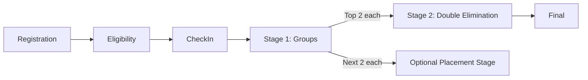

# Tournament and League Engine

## Core Concept

A tournament contains one or more divisions. A division contains an ordered **stage graph**. Each stage owns its format, participants, seeding, rounds, matches, scoring, tie-breaks, and advancement rules. This supports group stage into playoffs, round robin into a top-two final, direct top-32/64 playoffs, and future formats without changing the tournament record shape.



## Lifecycle

```text
draft -> configured -> registration_open -> registration_closed
      -> seeded -> locked -> live -> completed -> archived
                         \-> cancelled
```

- Draft/configured structures are editable.
- Seeding can be regenerated until lock; every preview has a deterministic seed and validation report.
- Lock creates a configuration snapshot and fixtures.
- Live stages permit operational data only: schedule changes, check-in, map vetoes, results, evidence, disputes, and audited rulings.
- Structural changes after lock require cancelling/replacing a not-yet-live stage or an explicit audited recovery workflow; silent mutation is forbidden.

`maxParticipants` is planning metadata, not a bracket size and not a signup limit. A division only closes as “Slots full” when `registrationRestricted` is enabled and `registrationLimit` has been reached. At start time, the engine uses the actual eligible, checked-in registrations, reseeds them from 1, and derives the next power-of-two bracket automatically. For example, a competition planned for 64 entrants with 48 checked in generates a 64-slot bracket with 16 deterministic byes.

Starting an event generates the first pending stage in each game competition. Later stages remain draft until their qualifiers are known. Match controls use audited transitions (`ready -> live -> paused/live -> final`), and “finish and start next” resolves dependent winner/loser slots before starting the next ready fixture.

Administrators can also start and complete each game competition independently. The pre-start report validates lifecycle state, stage format/configuration, checked-in eligibility, participant type, team roster bounds, optional registration limits, series length, round-robin legs, and the absence of existing fixtures before it writes anything. A game-specific preview contains only that division's generated bracket and match list. Completion is blocked until every persisted match in that division is `final`, `forfeit`, or `cancelled`; it then snapshots that division and marks the parent event completed only when all sibling competitions are terminal.

Completing an event is blocked until every started stage is complete. Completion writes immutable participant snapshots containing the tournament-time profile, roster, final rank, and sponsors whose dated sponsorship records overlap the event. Later profile or sponsor edits therefore do not rewrite historical event results.

## Stage Types

### Round Robin

- Single or double round robin.
- One or many groups.
- Berger/circle scheduling with a bye for odd participant counts.
- Home/away or side assignment balancing where relevant.
- Configurable points and ordered tie-break rules.
- Optional cross-group ranking only when group conditions are comparable.

### Single Elimination

- Power-of-two bracket size at or above participant count.
- Byes allocated according to published seeding policy.
- Best-of may vary by round.
- Optional third-place match.
- Explicit participant sources (`seed`, `winner of M1`, `group A rank 1`).

### Double Elimination

- Winners and losers lanes with deterministic drop paths.
- A participant is eliminated after two match losses, excluding policy-defined forfeiture/disqualification behavior.
- Grand final can be single-series advantage or reset-final mode; the rule is fixed before lock.
- Bracket slots reference source match outcome rather than copying participants manually.

### Custom Seeded Stage

Operators may build a validated fixture graph for special cases. The validator must reject cycles, impossible source paths, duplicated destinations, participant over-allocation, and matches without a resolvable completion path.

## Generation Pipeline

1. Normalize eligible checked-in participants into immutable competition snapshots.
2. Validate count, team size, duplicates, eligibility, region, and roster locks.
3. Select deterministic random seed and record it with generator version.
4. Assign seeds using manual ranking, rating, random draw, geographic separation, team separation, or a documented combination.
5. Expand bracket/group slots, byes, rounds, and match dependencies.
6. Apply stage-specific series/scoring configuration.
7. Validate graph and advancement destinations.
8. Produce a human-readable preview and warnings.
9. On operator confirmation, transactionally lock configuration and persist fixtures.

The same input configuration, participant snapshots, generator version, and random seed must produce the same fixtures.

## Standings Algorithm

Standings are projections derived from finalized match/game facts; operators never edit rank numbers directly.

For each participant calculate the configured metrics, for example:

```text
matches_played
match_wins / draws / losses
games_won / games_lost
score_for / score_against / score_difference
kills / deaths / assists or other game-defined stats
bonus_points / penalty_points
total_points
```

Apply the stage's versioned tie-break chain in order. A reasonable team-game default is:

1. total points;
2. head-to-head points among tied participants;
3. head-to-head score difference;
4. overall score difference;
5. overall score for;
6. game-specific metric such as kills only when the rules explicitly choose it;
7. strength-of-schedule or opponent score where configured;
8. administrator-scheduled tie-break match;
9. deterministic draw as the documented last resort.

Head-to-head mini-tables must be recalculated over the tied set. If a rule only partially resolves a tie, the configured policy decides whether the chain restarts for the remaining subset or continues; this behavior is stored in the scoring version.

## Advancement

Advancement is declarative and evaluated only from finalized standings/outcomes. Examples:

```text
group[*].rank <= 2             -> playoff seeds using cross-group mapping
stage(groups).overall_rank <= 8 -> single-elimination stage
winner(match:upper_final)      -> grand_final slot 1
winner(match:lower_final)      -> grand_final slot 2
```

Advancement creates target-stage participant records with a source trace. If an upstream result is under dispute, downstream affected matches are flagged and cannot be finalized without an operator override.

## Match and Result Rules

- Match states: `scheduled`, `ready`, `live`, `paused`, `reported`, `confirmed`, `final`, `disputed`, `forfeit`, `cancelled`.
- Store series score plus individual game/map facts.
- Require evidence or dual confirmation according to tournament policy.
- A result finalization transaction updates winner/outcome, downstream slot readiness, standings projection, audit event, and outbox event.
- Correcting a final result creates a revision, explains the reason, recomputes affected projections, and identifies downstream impact.
- Forfeit, no-show, walkover, disqualification, technical loss, and cancellation are distinct outcomes.

## Game-Specific Scoring

Statistics and scoring are driven by versioned definitions. A Dota-like event may use series wins for standings and kills as a later tie-break; a battle-royale event may combine placement and eliminations; a fighting game may record sets and rounds. The engine must not assume kills exist.

Initially formulas should be selected from safe, tested operators/configuration—not arbitrary JavaScript or SQL entered by admins. Each preset has validation limits, display labels, examples, and golden test cases.

## Validation Before Lock

- Participant count and bracket capacity are compatible.
- All entries are eligible, checked in, and uniquely placed.
- Seeds and groups satisfy configured separation constraints or report exceptions.
- Every match source has exactly one valid destination per outcome.
- Graph is acyclic and all advancing paths terminate.
- Advancement target capacity matches its sources.
- Best-of values, schedule windows, and venue/server capacity are valid.
- Scoring and tie-break keys exist for the selected game/mode.
- A simulation can complete every path without an unresolved slot.

## Testing Strategy

- Unit tests for circle scheduling, bracket sizing, byes, seed mapping, drop paths, ties, and advancement.
- Property-based tests asserting no duplicate placement, acyclic graphs, deterministic generation, and exactly one champion for completed knockout stages.
- Golden fixtures for 2, 3, 4, 5, 8, 16, 32, and 64 participants.
- Scenario tests for group-to-playoff, round-robin-to-final, forfeits, disqualification, disputes, corrected results, and grand-final reset.
- Concurrency tests for duplicate result submissions and simultaneous finalization.

## Presentation Guidance

Borrow the clarity of established esports references such as Liquipedia: persistent tournament navigation, stage tabs, visible match status, team/player identity, concise series scores, clear winners/losers paths, standings beside groups, and source-linked match details. Do not copy branding, content, templates, or implementation.
